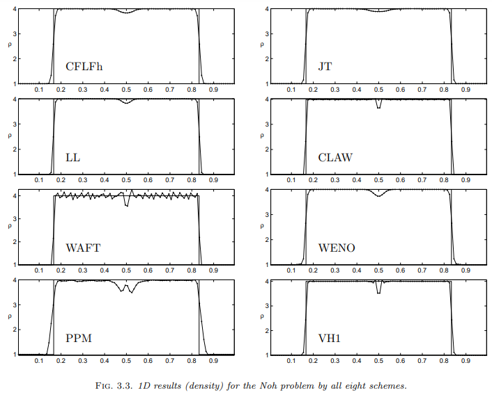

# 1D Noh Strong Shock
This test highlights the ability of a code to track a high Mach number shock. Density is set to 1.0 and pressure to 0.000001 everywhere. For x \< 0.5 the velocity is set to 1, while for x \> 0.5, velocity is set to -1. Gamma is set to 1.66667. This test was performed with the hydro build (`cholla/builds/make.type.hydro`). Full initial conditions can be found in `cholla/src/grid/initial_conditions.cpp`under `Riemann()`. 

## Parameter file: (modified from `cholla/examples/1D/noh_1D.txt`)
Modified to add yl_bcnd, yu_bcnd, zl_bcnd, and zu_bcnd=0. Changed init=Riemann. 
```
#
# Parameter File for Noh Strong Shock test
#

################################################
# number of grid cells in the x dimension
nx=100
# number of grid cells in the y dimension
ny=1
# number of grid cells in the z dimension
nz=1
# final output time
tout=1.0
# time interval for output
outstep=1.0
# name of initial conditions
init=Riemann
# domain properties
xmin=0.0
ymin=0.0
zmin=0.0
xlen=1.0
ylen=1.0
zlen=1.0
# type of boundary conditions
xl_bcnd=3
xu_bcnd=3
yl_bcnd=0
yu_bcnd=0
zl_bcnd=0
zu_bcnd=0
# path to output directory
outdir=./

#################################################
# Parameters for 1D Riemann problems
# density of left state
rho_l=1.0
# velocity of left state
vx_l=1.0
vy_l=0.0
vz_l=0.0
# pressure of left state
P_l=0.000001
# density of right state
rho_r=1.0
# velocity of right state
vx_r=-1.0
vy_r=0.0
vz_r=0.0
# pressure of right state
P_r=0.000001
# location of initial discontinuity
diaph=0.5
# value of gamma
gamma=1.66667
```
Upon completion, you should obtain two output files. The final density and pressure (in code units) of the solution is shown below .  Examples of how to extract and plot data can be found in `cholla/python_scripts/plot_sod.ipynb`.  
  

Note that currently (Cholla SHA ab36c0f630a82e6eb9ea5e0f43c9e4eb0e81b004) this solution does not match that of Liska and Wendroff 2003 (shown below): the center of the density plot does not flatten out, forming a maximum that abruptly drops off at the edges. 

 

Further, the Noh test performs differently upon variation of the output frequency (here, we also vary CFL numbers):

   


