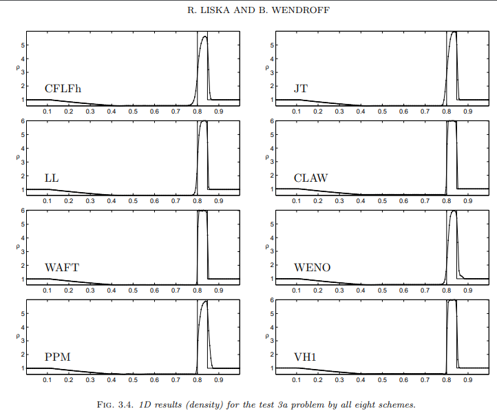

# 1D Stationary Contact
This test initializes a stationary contact. Parameters derived from Toro's *Riemann solvers and numerical methods for fluid dynamics* Sec. 6.4, test 5. The setup consists of a pressure of 1000 for 0 \< x \< 0.8 and 0.01 for 0.8 \< x \< 1.0. Density and velocity are equal on both sides of the contact with values of 1.0 and -19.59745, respectively. Gamma is set to 1.4. This test was performed with the hydro build (`cholla/builds/make.type.hydro`). Full initial conditions can be found in `cholla/src/grid/initial_conditions.cpp`under `Riemann()`.  

**Important:** This test must be run with diode boundaries [disabled](https://github.com/alwinm/cholla/tree/main-diode) in order to perform as expected (thank you @alwinm!).  

## Parameter file: (modified from`cholla/examples/1D/stationary.txt`)
Modified to add yl_bcnd, yu_bcnd, zl_bcnd, and zu_bcnd=0
```
#
# Parameter File for Toro test 5, a stationary contact.
# Parameters derived from Toro, Sec. 6.4.4, test 5
# Same as test 3a from Liska, 2003.
#

################################################
# number of grid cells in the x dimension
nx=100
# number of grid cells in the y dimension
ny=1
# number of grid cells in the z dimension
nz=1
# final output time
tout=0.012
# time interval for output
outstep=0.012
# name of initial conditions
init=Riemann
# domain properties
xmin=0.0
ymin=0.0
zmin=0.0
xlen=1.0
ylen=1.0
zlen=1.0
# type of boundary conditions
xl_bcnd=3
xu_bcnd=3
yl_bcnd=0
yu_bcnd=0
zl_bcnd=0
zu_bcnd=0
# path to output directory
outdir=./

#################################################
# Parameters for 1D Riemann problems
# density of left state
rho_l=1.0
# velocity of left state
vx_l=-19.59745
vy_l=0.0
vz_l=0.0

# pressure of left state
P_l=1000
# density of right state
rho_r=1.0
# velocity of right state
vx_r=-19.59745
vy_r=0.0
vz_r=0.0
# pressure of right state
P_r=0.01
# location of initial discontinuity
diaph=0.8
# value of gamma
gamma=1.4
```
Upon completion, you should obtain two output files. The initial and final density, pressure, and velocity (in code units) of the solution is shown below (pink dots) plotted over the exact solution (purple line). Examples of how to extract and plot data can be found in cholla/python_scripts/plot_sod.ipynb.  
  

We see a stationary contact at x = 0.8. The width of the contact is not fully resolved. With the diode disabled,this solution matches that of Liska and Wendroff 2003 (http://www-troja.fjfi.cvut.cz/~liska/CompareEuler/compare8-bw.pdf).

  

