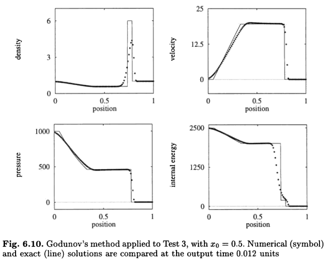

# 1D Test 3 (strong shock test)
This test is similar to the strong shock test but with only an initial pressure discontinuity. This shows the ability of a code to resolve contacts. Toro's *Riemann solvers and numerical methods for fluid dynamics* Sec. 6.3.3, test 3. The setup consists of a pressure of 1000 for 0 \< x \< 0.5 and 0.01 for 0.5 \< x \< 1.0. Gamma is set to 1.4 and density is 1.0 everywhere. This test was performed with the hydro build (`cholla/builds/make.type.hydro`). Full initial conditions can be found in `cholla/src/grid/initial_conditions.cpp`under `Riemann()`. 

## Parameter file: (modified from`cholla/examples/1D/test_3.txt`)
Modified to add yl_bcnd, yu_bcnd, zl_bcnd, and zu_bcnd=0
```
#
# Parameter File for test 3 (strong shock test)
# Parameters derived from Toro, Sec. 6.4.4, test 3
#

################################################
# number of grid cells in the x dimension
nx=100
# number of grid cells in the y dimension
ny=1
# number of grid cells in the z dimension
nz=1
# final output time
tout=0.012
# time interval for output
outstep=0.012
# name of initial conditions
init=Riemann
# domain properties
xmin=0.0
ymin=0.0
zmin=0.0
xlen=1.0
ylen=1.0
zlen=1.0
# type of boundary conditions
xl_bcnd=3
xu_bcnd=3
yl_bcnd=0
yu_bcnd=0
zl_bcnd=0
zu_bcnd=0
# path to output directory
outdir=./

#################################################
# Parameters for 1D Riemann problems
# density of left state
rho_l=1.0
# velocity of left state
vx_l=0.0
vy_l=0.0
vz_l=0.0
# pressure of left state
P_l=1000
# density of right state
rho_r=1.0
# velocity of right state
vx_r=0.0
vy_r=0.0
vz_r=0.0
# pressure of right state
P_r=0.01
# location of initial discontinuity
diaph=0.5
# value of gamma
gamma=1.4
```
Upon completion, you should obtain two output files. The initial and final density, pressure, and velocity (in code units) of the solution is shown below (pink dots) plotted over the exact solution (purple line). Examples of how to extract and plot data can be found in cholla/python_scripts/plot_sod.ipynb.  
  

We see a contact discontinuity follow directly by a shock. This solution is in agreement with that of Toro test 3, shown below:  
   
 
