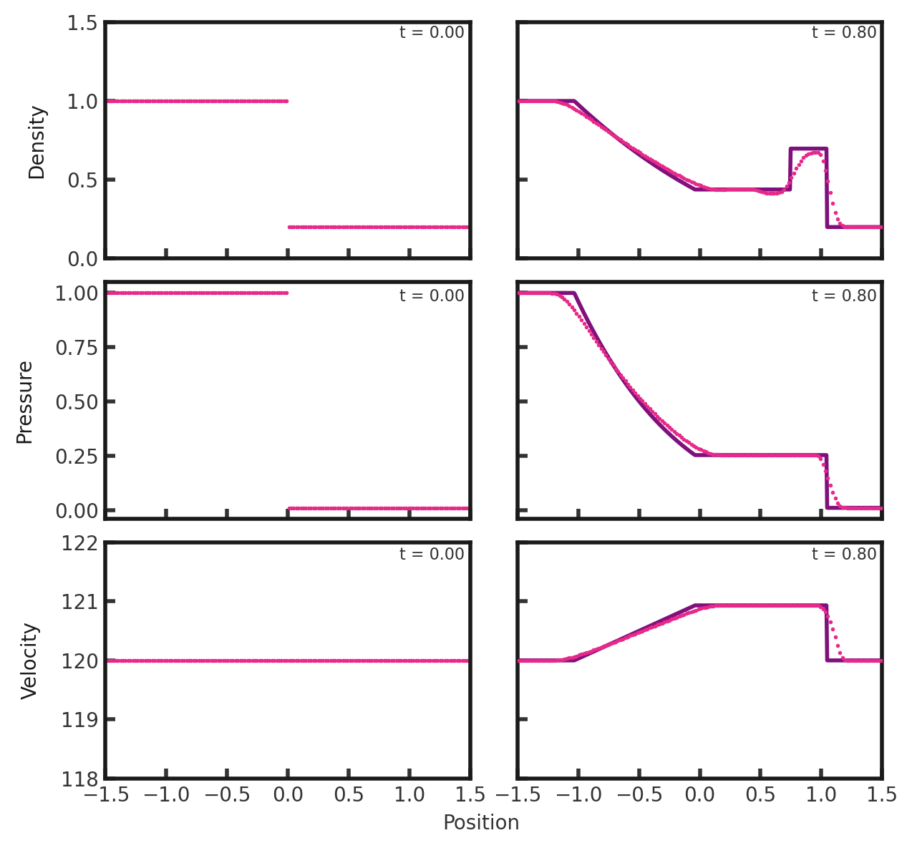
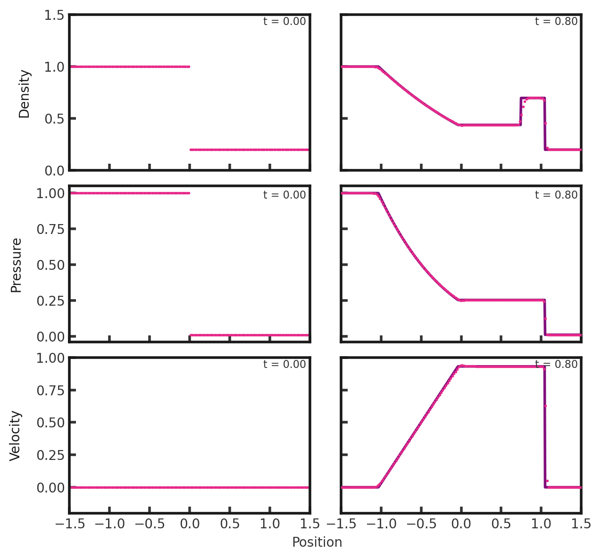
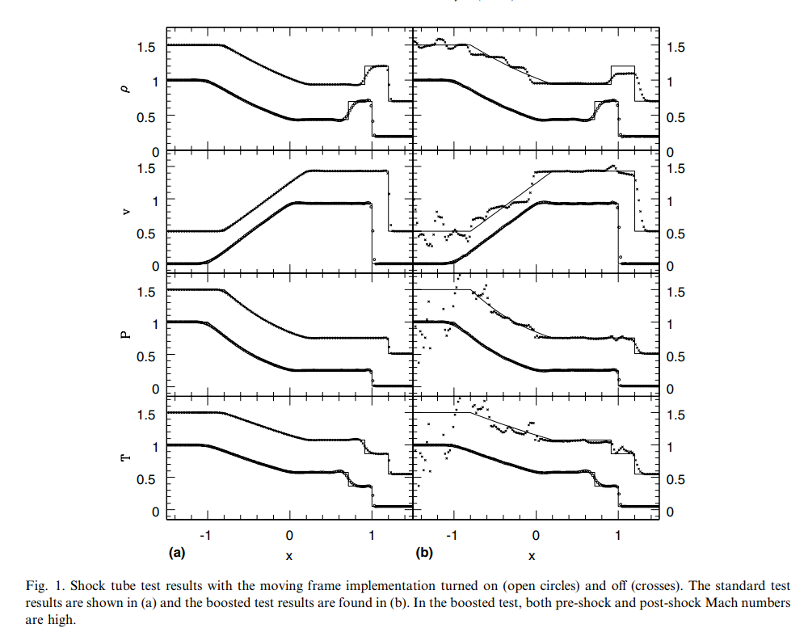

# 1D Trac-Pen Shock Tube
This test shows the ability of a code to resolve shocks in high mach numbers and is originally from Trac & Pen, 2004. The setup consists of a density and pressure of 11.0 for -3 \< x \< 0 and 0.01. For 0 \< x \< 3.0, density is set to 0.2 and pressure to 0.01. Gamma is set to 1.66666667 and the velocity is 120.0 ('boosted') everywhere. This test was performed with the hydro build (`cholla/builds/make.type.hydro`). Full initial conditions can be found in `cholla/src/grid/initial_conditions.cpp`under `Riemann()`. 

## Parameter file: (modified from`cholla/examples/1D/trac_pen.txt`)
Modified to add yl_bcnd, yu_bcnd, zl_bcnd, and zu_bcnd=0
```
#
# Parameter File for 1D Shock tube
# described in Trac & Pen, 2004
#

################################################
# number of grid cells in the x dimension
nx=300
# number of grid cells in the y dimension
ny=1
# number of grid cells in the z dimension
nz=1
# final output time
tout=0.8
# time interval for output
outstep=0.8
# name of initial conditions
init=Riemann
# domain properties
xmin=-3.0
ymin=0.0
zmin=0.0
xlen=6.0
ylen=1.0
zlen=1.0
# type of boundary conditions
xl_bcnd=1
xu_bcnd=1
yl_bcnd=0
yu_bcnd=0
zl_bcnd=0
zu_bcnd=0
# path to output directory
outdir=./

#################################################
# Parameters for 1D Riemann problems
# density of left state
rho_l=1.0
# velocity of left state
vx_l=120.0
vy_l=0.0
vz_l=0.0
# pressure of left state
P_l=1.0
# density of right state
rho_r=0.2
# velocity of right state
vx_r=120.0
vy_r=0.0
vz_r=0.0
# pressure of right state
P_r=0.01
# location of initial discontinuity
diaph=0.0
# value of gamma
gamma=1.66666667
```
Upon completion, you should obtain two output files. The initial and final density, pressure, and velocity (in code units) of the solution (pink dots) is shown below compared to the exact solution (purple line). Note that we only plot on the domain [-1.5, 1.5]. Examples of how to extract and plot data can be found in cholla/python_scripts/plot_sod.ipynb.  
  
We see a shock, followed by a rarefaction, contact discontinuity, shock, shock, and rarefaction.  
We can also compare to the performace of the shock tube with no boost:  
  
This solution is in agreement with that of Trac and Pen (2004):  
Plot information from Trac and Pen (2004): "In Fig. 1, we compare the results of the static and boosted tests. In Fig. 1(a), the static test results for MACH code (open circles) and Relaxing TVD code (crosses) are plotted against the exact solution (solid lines). The Relaxing TVD results have been shifted both horizontally and vertically for clarity. The plots have been rescaled such that the initial discontinuity is placed at x = 0 and the shock front at x = 1. The grid spacing corresponds to delta x =  0.02"  

  


