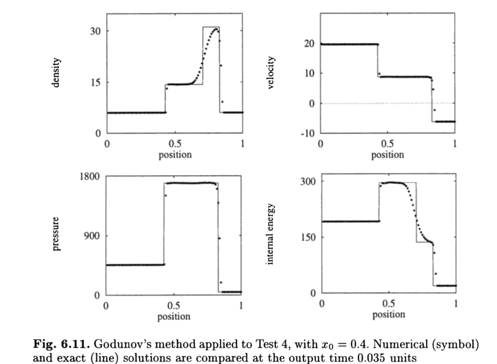

# 1D Two Shocks
This test highlights a collision between two shocks. This test is from Toro's *Riemann solvers and numerical methods for fluid dynamics* Sec. 6.4, test 4.The test consists of left and right states separated at x = 0.4 with velocities 19.5975 and -6.19633, respectively. Density of the left side is 5.99924 and pressure is 460.894. For the right side, density is 5.99242 while pressure is 46.095. Gamma is set to 1.4. This test is performed with the hydro build (`cholla/builds/make.type.hydro`). Full initial conditions can be found in `cholla/src/grid/initial_conditions.cpp`under `Riemann()`.  

**Important:** This test must be run with diode boundaries [disabled](https://github.com/alwinm/cholla/tree/main-diode) in order to perform as expected (thank you @alwinm!).  

## Parameter file: (**modified** to add y and z boundary conditions = 0 from `cholla/examples/1D/two_shocks.txt`)
```
#
# Parameter File for Toro test 4, a collision of two shocks.
# Parameters derived from Toro, Sec. 6.4.4, test 4
#

################################################
# number of grid cells in the x dimension
nx=100
# number of grid cells in the y dimension
ny=1
# number of grid cells in the z dimension
nz=1
# final output time
tout=0.035
# time interval for output
outstep=0.035
# name of initial conditions
init=Riemann
# domain properties
xmin=0.0
ymin=0.0
zmin=0.0
xlen=1.0
ylen=1.0
zlen=1.0
# type of boundary conditions
xl_bcnd=3
xu_bcnd=3
yl_bcnd=0
yu_bcnd=0
zl_bcnd=0
zu_bcnd=0
# path to output directory
outdir=./

#################################################
# Parameters for 1D Riemann problems
# density of left state
rho_l=5.99924
# velocity of left state
vx_l=19.5975
vy_l=0.0
vz_l=0.0

# pressure of left state
P_l=460.894
# density of right state
rho_r=5.99242
# velocity of right state
vx_r=-6.19633
vy_r=0.0
vz_r=0.0
# pressure of right state
P_r=46.095
# location of initial discontinuity
diaph=0.4
# value of gamma
gamma=1.4
```
Upon completion, you should obtain 2 output files. The initial and final density, pressure, and velocity (in code units) of the solution is shown below (pink dots) plotted over the exact solution (purple line). Examples of how to extract and plot data can be found in `cholla/python_scripts/plot_sod.ipynb`.  
  

We see a shock, contact discontinuity, and a shock, which is in agreement with Toro's solution and can be seen below:  

  

