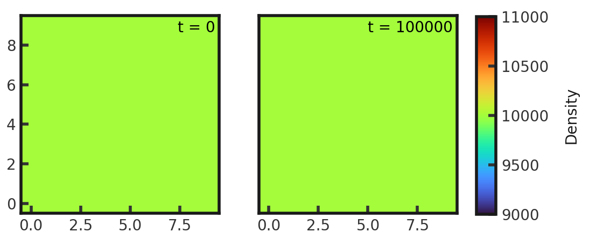
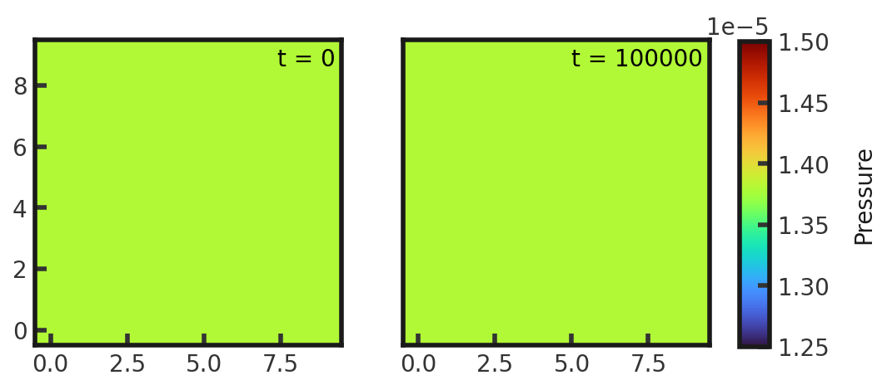

# 2D Constant
This models a box filled with gas in the absence of a magnetic field. The test consists a density of 1e4 and pressure of 1.380658e-5. Gamma is set to 1.666666667. This test is performed with the default hydro build (`cholla/builds/make.type.hydro`). Full initial conditions can be found in `cholla/src/grid/initial_conditions.cpp`under `Constant()`. 

## Parameter file: (`cholla/examples/2D/constant.txt`)
```
#
# Parameter File for 3D box filled with gas
#

################################################
# number of grid cells in the x dimension
nx=10
# number of grid cells in the y dimension
ny=10
# number of grid cells in the z dimension
nz=1
# final output time
tout=100000.0
# time interval for output
outstep=100000.0
# name of initial conditions
init=Constant
# domain properties
xmin=0.0
ymin=0.0
zmin=0.0
xlen=1.0
ylen=1.0
zlen=1.0
# type of boundary conditions
xl_bcnd=1
xu_bcnd=1
yl_bcnd=1
yu_bcnd=1
zl_bcnd=1
zu_bcnd=1
# path to output directory
outdir=./

#################################################
# density
rho=1e4
# velocity
vx=0
vy=0
vz=0
# pressure
P=1.380658e-5
# Magnetic Field
Bx=0.0
By=0.0
Bz=0.0
# value of gamma
gamma=1.666666667
```
Upon completion, you should obtain 2 output files. The pressure and density remain constant over the grid for the duration of the integration. The L1 error norm for pressure, density, all three components of velocity, and energy is zero.

The initial and final density and pressure (in code units) is shown below. Examples of how to plot projections and slices can be found in `cholla/python_scripts/Projection_Slice_Tutorial.ipynb`.  
  
  
