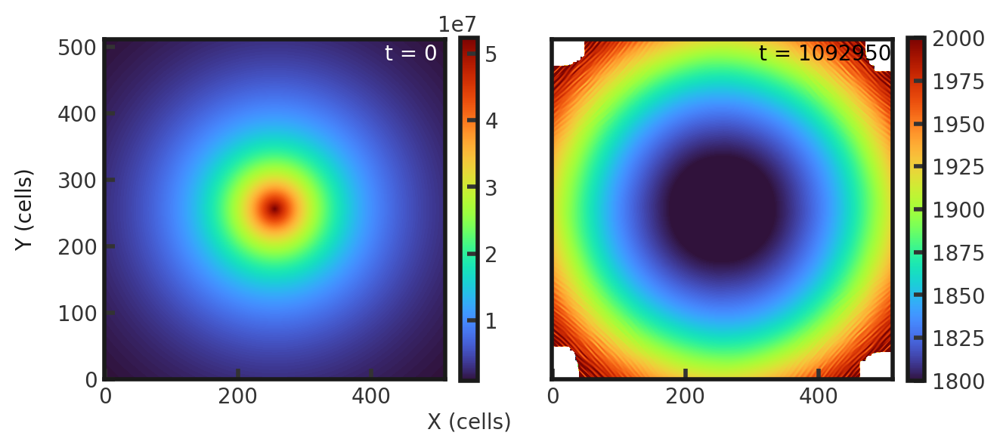
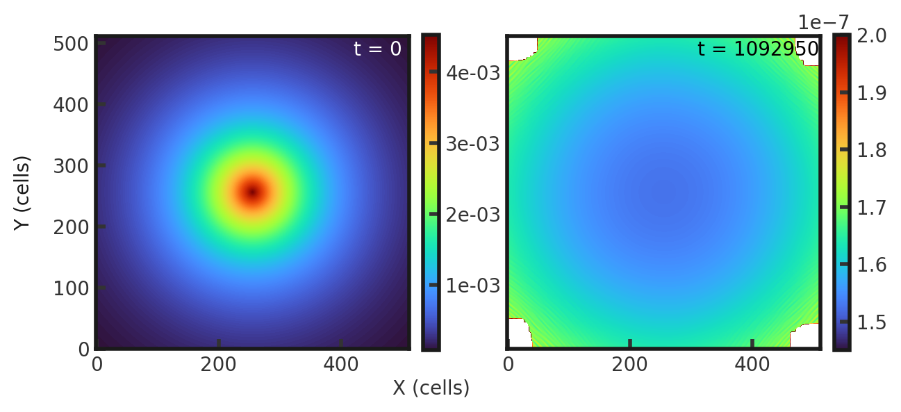

# 2D Disk
This models the Milky Way's stellar disk following a Kuzmin profile. Gamma is set to 1.001. Full initial conditions can be found in `cholla/src/grid/initial_conditions.cpp`under `Disk_2D()`. This test is performed with the disk build (`cholla/builds/make.type.disk`).  

## Parameter file: (`cholla/examples/2D/disk.txt`)
```
#
# Parameter File for a 2D disk in keplerian rotation.
#

######################################
# number of grid cells in the x dimension
nx=512
# number of grid cells in the y dimension
ny=512
# number of grid cells in the z dimension
nz=1
# final output time
tout=1092950
# time interval for output
outstep=2185.9
# value of gamma
gamma=1.001
# name of initial conditions
init=Disk_2D
# domain properties
xmin=-20
ymin=-20
zmin=-20
xlen=40
ylen=40
zlen=40
# type of boundary conditions
xl_bcnd=3
xu_bcnd=3
yl_bcnd=3
yu_bcnd=3
zl_bcnd=3
zu_bcnd=3
# path to output directory
outdir=./
```
Upon completion, you should obtain 501 output files. However, after the first ~54 snaps, I get the error: Thread crashed in final update. -nan -nan -nan. The simulation continues to run and output but with incomplete data. The initial and final density and pressure (in code units) is shown below. Examples of how to plot projections and slices can be found in `cholla/python_scripts/Projection_Slice_Tutorial.ipynb`.  
  
  
