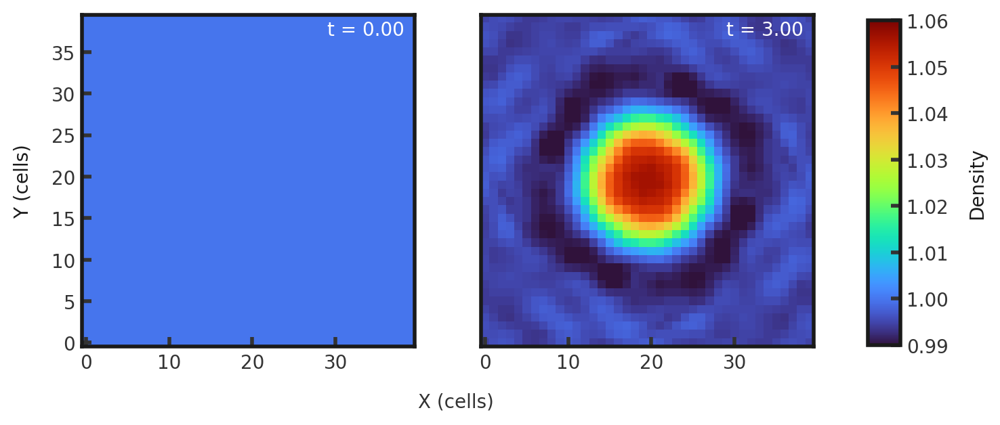
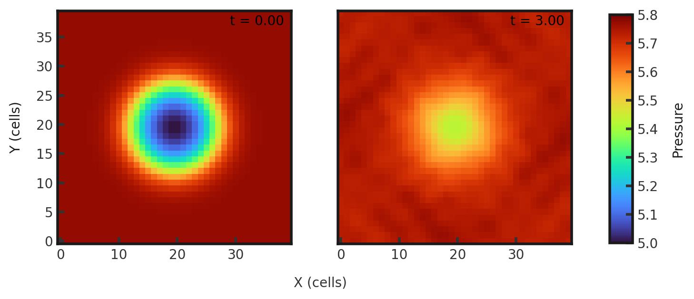
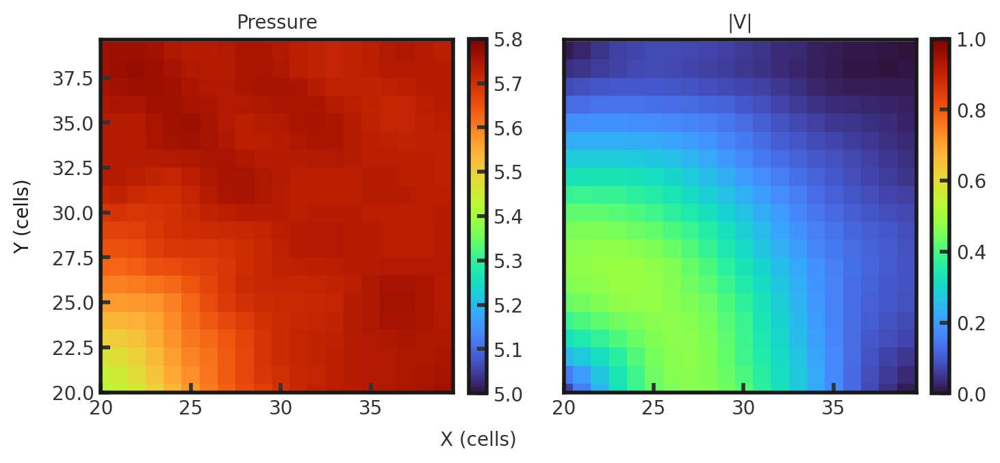
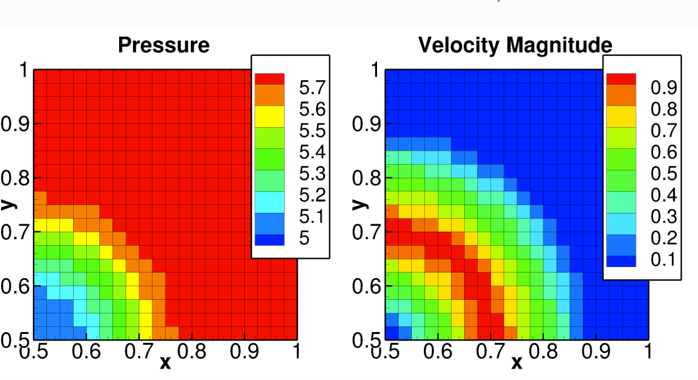

# 2D Gresho Vortex
This test is used to test accuracy, conservation of angular momentum, and symmetry. It produces a stationary, time-independent vortex in which the centrifugal force is exactly balanced by pressure gradients. Parameters from Liska and Wendroff 2003. A vortex is centered at the origin, with density set to 1.0 everywhere. Gamma is set to 1.4. Full initial conditions can be found in `cholla/src/grid/initial_conditions.cpp`under `Gresho()`.This test is performed with the default hydro build (`cholla/builds/make.type.hydro`).  

## Parameter file: (`cholla/examples/2D/Gresho.txt`)
```
#
# Parameter File for the 2D Gresho vortex test.
#

######################################
# number of grid cells in the x dimension
nx=40
# number of grid cells in the y dimension
ny=40
# number of grid cells in the z dimension
nz=1
# final output time
tout=3.0
# time interval for output
outstep=0.05
# value of gamma
gamma=1.4
# name of initial conditions
init=Gresho
# domain properties
xmin=-0.5
ymin=-0.5
zmin=0.0
xlen=1.0
ylen=1.0
zlen=1.0
# type of boundary conditions
xl_bcnd=1
xu_bcnd=1
yl_bcnd=1
yu_bcnd=1
zl_bcnd=0
zu_bcnd=0
# path to output directory
outdir=./
```
Upon completion, you should obtain 61 output files. The initial and final densities and pressures (in code units) is shown below. Examples of how to plot projections and slices can be found in `cholla/python_scripts/Projection_Slice_Tutorial.ipynb`.  
Density:  
  
Pressure:  
  

Final pressure and magnitude of velocity of the upper right corner is shown below:
  

We can compare final pressure and magnitude of velocity to Multiphase Flow with Interphase eXchanges (MFiX) [test manual](https://mfix.netl.doe.gov/doc/vvuq-manual/main/html/fluid/fld-04.html):
  

While the velocity plot is in agreement, the pressure at the center of the vortex computed by Cholla is higher than that of MFiX.  
