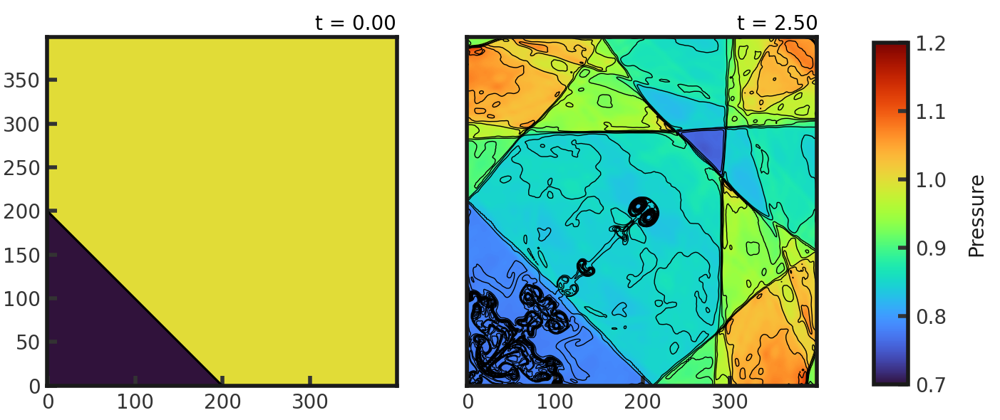
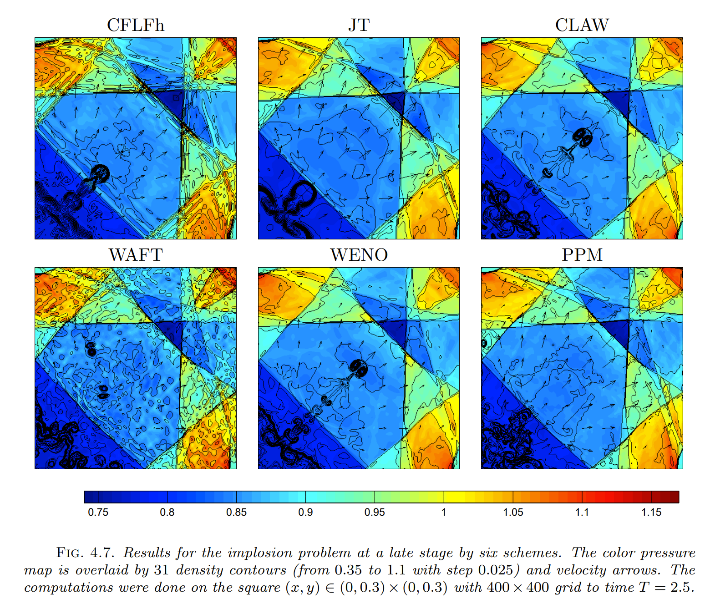

# 2D Implosion
This tests a code's ability to resolve contact discontinuities for a non-grid aligned shock tube and can determine the symmetry of a code. It consists of a diamond region of density = 0.125 and pressure = 0.14 inside a square region of both density and pressure of 1. Parameters from Liska and Wendroff 2003. Gamma is set to 1.4. Full initial conditions can be found in `cholla/src/grid/initial_conditions.cpp`under `Implosion_2D()`.This test is performed with the default hydro build (`cholla/builds/make.type.hydro`).  

**Important:** This test must be run with diode boundaries [disabled](https://github.com/alwinm/cholla/tree/main-diode) in order to perform as expected (thank you @alwinm!).  

## Parameter file: (`cholla/examples/2D/Implosion_2D.txt`)
```
#
# Parameter File for the 2D implosion test described in Liska, 2003.
#

######################################
# number of grid cells in the x dimension
nx=400
# number of grid cells in the y dimension
ny=400
# number of grid cells in the z dimension
nz=1
# output time
tout=2.5
# how often to output
outstep=0.01
n_hydro=1
# value of gamma
gamma=1.4
# name of initial conditions
init=Implosion_2D
# domain properties
xmin=0.0
ymin=0.0
zmin=0.0
xlen=0.3
ylen=0.3
zlen=0.3
# type of boundary conditions
xl_bcnd=2
xu_bcnd=2
yl_bcnd=2
yu_bcnd=2
zl_bcnd=0
zu_bcnd=0
# path to output directory
outdir=./
```
Upon completion, you should obtain 251 output files. The initial and final pressure (in code units) is shown below. Final color pressure map is overlaid by 36 density contours from 0.125 to 1. Examples of how to plot projections and slices can be found in `cholla/python_scripts/Projection_Slice_Tutorial.ipynb`.  
  

We see that a jet has appeared in the solution due to the high symmetry preservation of Cholla. 

We can compare this to the results of Liska and Wendroff (2003). Non-symmetry perserving codes, often employing Strang splitting, fail to produce the jet:
  


