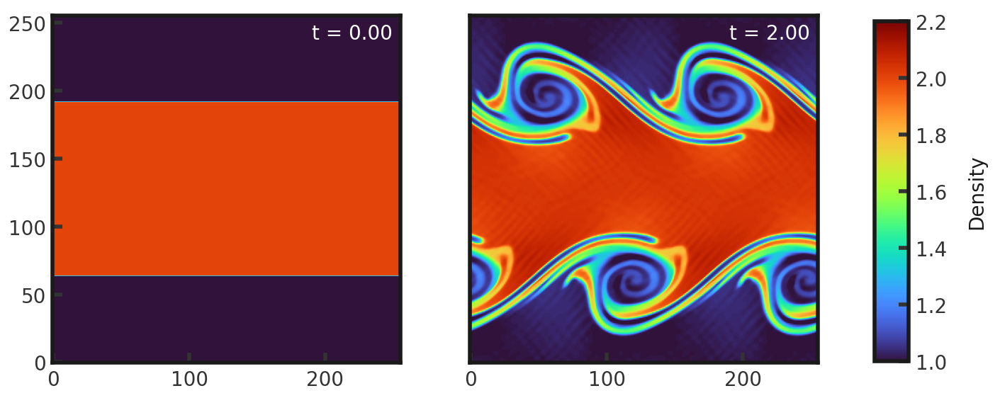
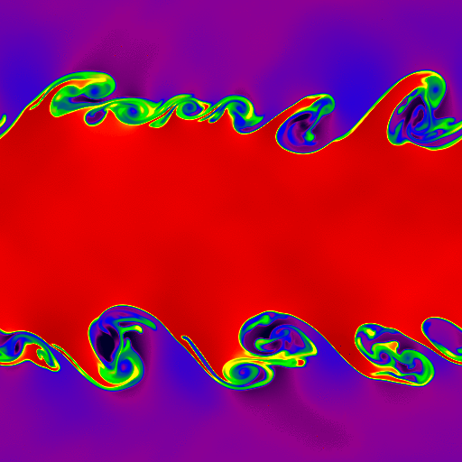

# 2D Discontinuous Kelvin-Helmholtz Test
This test highlights the ability of a code to resolve mixing caused by shear flows, emphasizing the importance of an efficient, high order reconstuction method and a fast code. The level of mixing increases with the resolution. See Chandrasekhar 1961. It consists of a high density region (density = 1 and x velocity = 0.5) in the middle third of the grid sandwiched between two low density regions (density = 1 and x velocity = -0.5). Y-velocities are perturbed by a sine wave of amplitude 0.1. Pressure is 2.5 everywhere and gamma is set to 1.666667. Full initial conditions can be found in `cholla/src/grid/initial_conditions.cpp`under `KH()`.This test is performed with the default hydro build (`cholla/builds/make.type.hydro`).  


## Parameter file: (`cholla/examples/2D/KH_discontinuous_2D.txt`)
```
#
# Parameter File for the 2D discontinuous Kelvin-Helmholtz test.
#

######################################
# number of grid cells in the x dimension
nx=256
# number of grid cells in the y dimension
ny=256
# number of grid cells in the z dimension
nz=1
# final output time
tout=2.0
# time interval for output
outstep=0.01
n_hydro=1
# value of gamma
gamma=1.666667
# name of initial conditions
init=KH
# domain properties
xmin=0.0
ymin=0.0
zmin=0.0
xlen=1.0
ylen=1.0
zlen=1.0
# type of boundary conditions
xl_bcnd=1
xu_bcnd=1
yl_bcnd=1
yu_bcnd=1
zl_bcnd=0
zu_bcnd=0
# path to output directory
outdir=./
```
Upon completion, you should obtain 201 output files. The initial and final density and pressure (in code units) is shown below. Examples of how to plot projections and slices can be found in `cholla/python_scripts/Projection_Slice_Tutorial.ipynb`.  
Density:  
  
Pressure:  
  

We see even on a relatively low resolution grid, significant shear mixing has occured. An evolution of the density at 10 fps is seen below:  

https://github.com/evazlimen/cholla-example-tests/assets/109487593/11b32ddc-48f4-4185-b5cf-d391918a2445  

We can compare Cholla (left) to the results of the [Athena](https://www.astro.princeton.edu/~jstone/Athena/tests/kh/kh.html) code (right), on a 512x512 grid at t = 1.00. Density is shown on a linear color map between 0.9 and 2.1  
  
  


