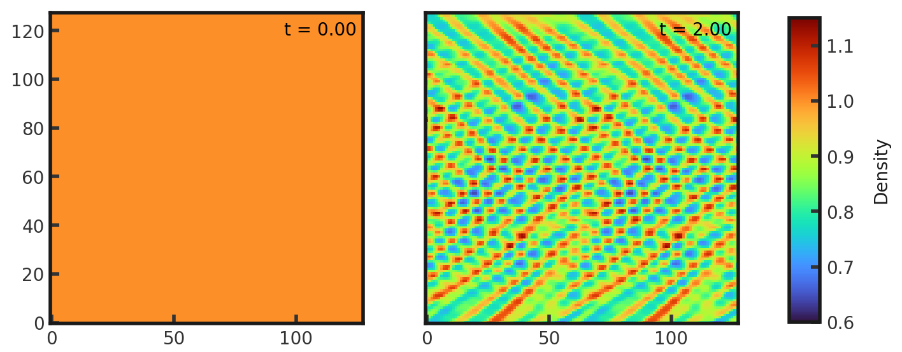
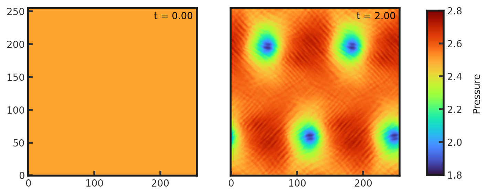

# 2D Resolution Independent Kelvin-Helmholtz Test
This test highlights the ability of a code to resolve mixing caused by shear flows, emphasizing the importance of an efficient, high order reconstuction method and a fast code. In general, the level of mixing would increase with the resolution; however, this is a resolution independent version. The test consists of a region of higher density (100) sandwiched between two regions of lower density (1.0). The high density layer has a velocity of 10.5 and the low density layers have a velocity of 9.5. Pressure is set to 2.5 and a 1% pertubation (amplitude of 0.1) is added to the high density layer to provoke the instability. Gamma is set to 1.6666666666666667. This test is performed with the default hydro build (`cholla/builds/make.type.hydro`). Full initial conditions can be found in `cholla/src/grid/initial_conditions.cpp`under `KH_res_ind()`. 

## Parameter file: (`cholla/examples/2D/KH_res_ind_2D.txt`)
```
#
# Parameter File for the 2D resolution independent Kelvin-Helmholtz test.
#

######################################
# number of grid cells in the x dimension
nx=128
# number of grid cells in the y dimension
ny=128
# number of grid cells in the z dimension
nz=1
# final output time
tout=2.0
# time interval for output
outstep=0.01
# value of gamma
gamma=1.6666666666666667
# name of initial conditions
init=KH_res_ind
# domain properties
xmin=0.0
ymin=0.0
zmin=0.0
xlen=1.0
ylen=1.0
zlen=1.0
# type of boundary conditions
xl_bcnd=1
xu_bcnd=1
yl_bcnd=3
yu_bcnd=3
zl_bcnd=1
zu_bcnd=1
# path to output directory
outdir=./
```

Upon completion, you should obtain 201 output files. The initial and final density and pressure (in code units) is shown below. Examples of how to plot projections and slices can be found in `cholla/python_scripts/Projection_Slice_Tutorial.ipynb`.  
Density:  
  
Pressure:  
  

This does not match the solution for the 3D example! It appears the initial conditions are not being set correctly. Also, the parameter file includes boundaries for the z direction, and the boundaries in the y direction are different than those in the 3D KH resolution independent test. 


