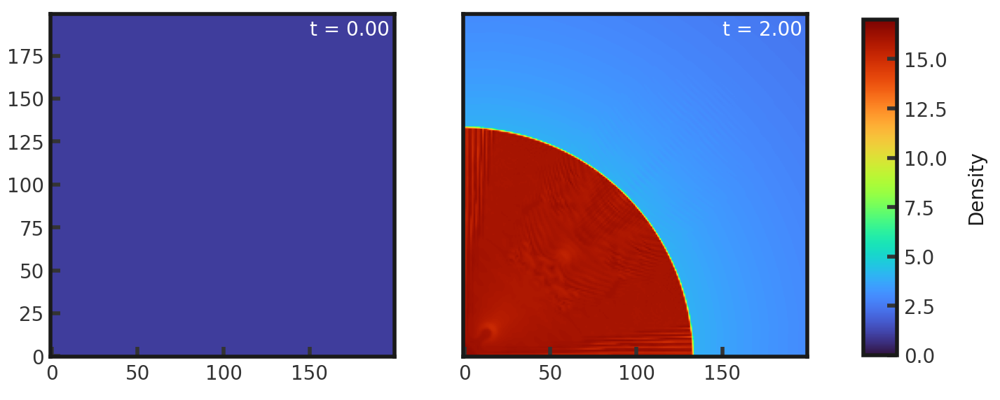

# 2D Noh Strong Shock
This test highlights the ability of a code to track a high Mach number shock. Parameters from Liska and Wendroff 2003. The test consists of an infinitely strong circular shock radiating from the origin. There is initially a constant density of 1.0 across the grid and a velocity of 1.0 towards the center everywhere. Pressure is set to $10^{-6}$ everywhere. Gamma is set to 1.66666667. This test is performed with the default hydro build (`cholla/builds/make.type.hydro`). Full initial conditions can be found in `cholla/src/grid/initial_conditions.cpp`under `Noh_2D()`. 

**Important**: refer to [issue 323](https://github.com/cholla-hydro/cholla/issues/323) in order to run on dev.  

## Parameter file: (modified from `cholla/examples/2D/Noh_2D.txt`)  
Modified to add zl_bcnd=0 and zu_bcnd=0. 
```
#
# Parameter File for the 2D Noh problem described in Liska, 2003.
#

######################################
# number of grid cells in the x dimension
nx=200
# number of grid cells in the y dimension
ny=200
# number of grid cells in the z dimension
nz=1
# output time
tout=2.0
# how often to output
outstep=0.01
# value of gamma
gamma=1.66666667
# name of initial conditions
init=Noh_2D
# domain properties
xmin=0.0
ymin=0.0
zmin=0.0
xlen=1.0
ylen=1.0
zlen=1.0
# type of boundary conditions
xl_bcnd=2
xu_bcnd=4
yl_bcnd=2
yu_bcnd=4
zl_bcnd=0
zu_bcnd=0
custom_bcnd=noh
# path to output directory
outdir=./
```
Upon completion, you should obtain 201 output files. The initial and final densities and pressures (in code units) are shown below. Examples of how to plot projections and slices can be found in `cholla/python_scripts/Projection_Slice_Tutorial.ipynb`.  
  

  

We can compare to the [Fyris Alpha code](https://rsaa.anu.edu.au/research/established-projects/fyris/2-d-noh-shock-test):  
  
