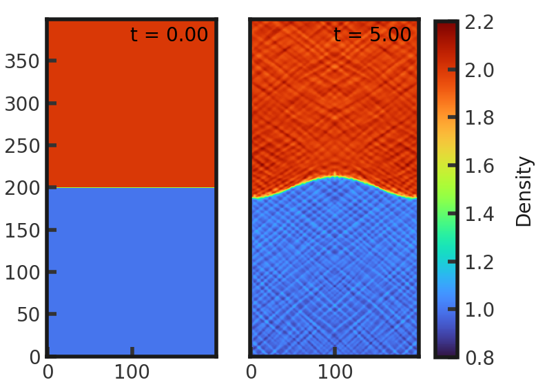
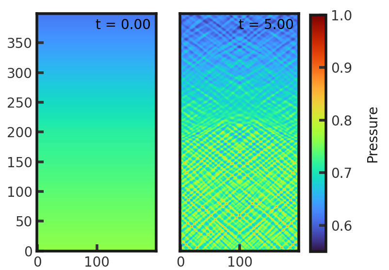
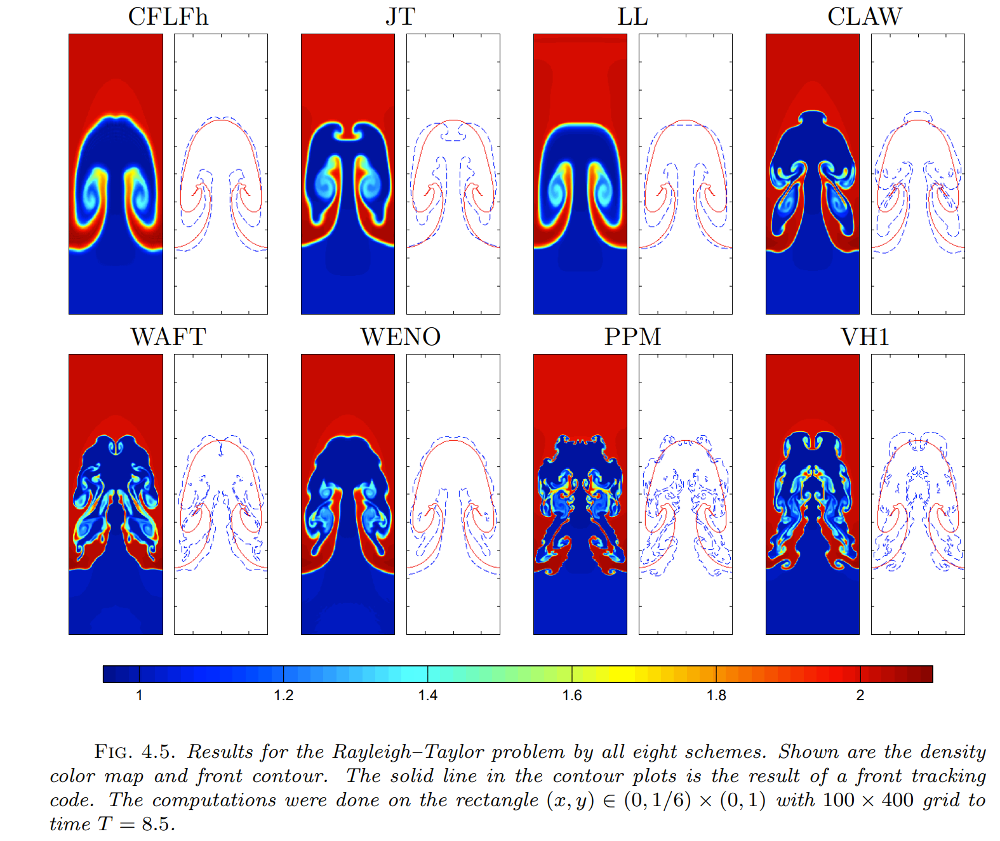

# 2D Rayleigh-Taylor Test
This test demonstrates the mixing resulting from a dense fluid placed on top of a less dense fluid. The bottom half of the grid is given of density of 1.0 while the top has a value of 2.0. Y velocities across the grid are set as a small pertubation tapering off from the center. For both halves, pressure is initialized as decreasing with increasing y position. Gamma is set to 1.4. This test is performed with the default hydro (?) build (`cholla/builds/make.type.hydro`). Results were found to be the same with the gravity build.  Full initial conditions can be found in `cholla/src/grid/initial_conditions.cpp`under `Rayleigh_Taylor()`. 

## Parameter file: (`cholla/examples/2D/Rayleigh_Taylor.txt`)
```
#
# Parameter File for the 2D Rayleigh-Taylor test.
#

######################################
# number of grid cells in the x dimension
nx=200
# number of grid cells in the y dimension
ny=400
# number of grid cells in the z dimension
nz=1
# final output time
tout=5.0
# time interval for output
outstep=0.05
# value of gamma
gamma=1.4
# name of initial conditions
init=Rayleigh_Taylor
# domain properties
xmin=0.0
ymin=0.0
zmin=0.0
xlen=0.33333333
ylen=1.0
zlen=1.0
# type of boundary conditions
xl_bcnd=1
xu_bcnd=1
yl_bcnd=2
yu_bcnd=2
zl_bcnd=0
zu_bcnd=0
# path to output directory
outdir=./
```

Upon completion, you should obtain 101 output files. The initial and final density and pressure (in code units) is shown below. Examples of how to plot projections and slices can be found in `cholla/python_scripts/Projection_Slice_Tutorial.ipynb`.  
  
  

This does not match the solution from Liska and Wendroff (2003)!
  

Mixing has barely occured in the Cholla solution. Attempts to increase the simulation runtime have so far been unsuccessful in producing a solution similar to the above example. Both the gravity and hydro builds produce the same results.


