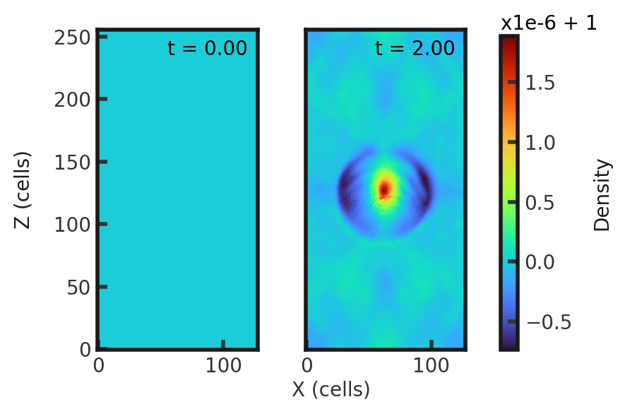

# 3D Advecting Field Loop
This test illustrates the ability of a code to preserve $B_{z}$ = 0 (and thus $\del \dot B = 0$) for all time. The test consists of a magnetic loop of magnetic amplitude 0.001 and radius 0.3. The density and pressure are initally 1.0, and the velocity is $\hat{x}$ + $\hat{y}$ + 2 $\hat{z}$. This test is performed with the mhd build (`cholla/builds/make.type.mhd`). Full initial conditions can be found in `cholla/src/grid/initial_conditions.cpp`under `Advecting_Field_Loop()`. 

## Parameter file: (`cholla/examples/3D/advecting_field_loop.txt`)
```
#
# Parameter File for an MHD Advecting Field Loop as defined in
# [Gardiner & Stone 2008](https://ui.adsabs.harvard.edu/abs/2008JCoPh.227.4123G/abstract)
#

################################################
# number of grid cells in the x dimension
nx=128
# number of grid cells in the y dimension
ny=128
# number of grid cells in the z dimension
nz=256
# final output time
tout=2.0
# time interval for output
outstep=2.0
# name of initial conditions
init=Advecting_Field_Loop
# domain properties
xmin=-0.5
ymin=-0.5
zmin=-1.0
xlen=1.0
ylen=1.0
zlen=2.0
# type of boundary conditions
xl_bcnd=1
xu_bcnd=1
yl_bcnd=1
yu_bcnd=1
zl_bcnd=1
zu_bcnd=1
# path to output directory
outdir=./

#################################################
# Parameters for advecting field loop problem
# initial density
rho=1.0
# velocity in the x direction
vx=1.0
# velocity in the y direction
vy=1.0
# velocity in the z direction
vz=2.0
# initial pressure
P=1.0
# amplitude of the loop/magnetic field background value
A=0.001
# Radius of the Loop
radius=0.3

# value of gamma
gamma=1.666666666666667
```
Upon completion, you should obtain 2 output files. The initial and final densities (in code units) of a slice along the y-midplane is shown below.  Examples of how to plot projections and slices can be found in `cholla/python_scripts/Projection_Slice_Tutorial.ipynb`.  
  
  

By changing the outstep to 0.05, you will obtain 41 output files and can obtain the below animation:

https://github.com/evazlimen/cholla-example-tests/blob/main/images/advecting_field_loop_density.mp4

We see the loop moving to the upper right, prompting fluctuations in the background as it transitions out of view before returning in the lower left. 
