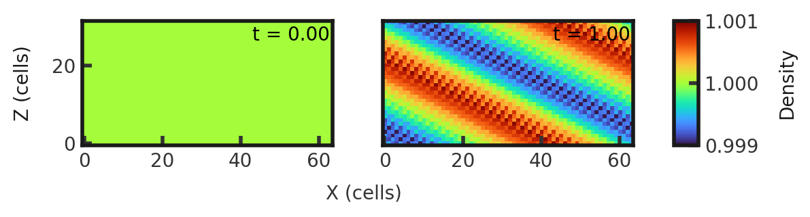

# 3D Circularly Polarized Alfven Wave
This is an exact nonlinear solution to the MHD equations. It is often used for convergence testing and to test how the code handles nonlinearity. The test consists a density of 1.0 and pressure of 0.1 with a right polarized moving wave of amplitude 0.1 and wavelength 1.0. The magnetic field is initialized as 1 $\hat{x}$. This test is performed with the mhd build (`cholla/builds/make.type.mhd`). Full initial conditions can be found in `cholla/src/grid/initial_conditions.cpp`under `Circularly_Polarized_Alfven_Wave()`. 

## Parameter file: (`cholla/examples/3D/cicularly_polarized_alfven_wave.txt`)
```
#
# Parameter File for the circularly polarized Alfven Wave
# See [Gardiner & Stone 2008](https://arxiv.org/abs/0712.2634) pages 4134-4135
# for details.
#

################################################
# number of grid cells in the x dimension
nx=64
# number of grid cells in the y dimension
ny=32
# number of grid cells in the z dimension
nz=32
# final output time
tout=1.0
# time interval for output
outstep=1.0
# name of initial conditions
init=Circularly_Polarized_Alfven_Wave
# domain properties
xmin=0.0
ymin=0.0
zmin=0.0
xlen=3.0
ylen=1.5
zlen=1.5
# type of boundary conditions
xl_bcnd=1
xu_bcnd=1
yl_bcnd=1
yu_bcnd=1
zl_bcnd=1
zu_bcnd=1
# path to output directory
outdir=./

#################################################
# Parameters for linear wave problems
# Polarization. 1 = right polarized, -1 = left polarized
polarization=1.0
# velocity in the x direction. 0 for moving wave, -1 for standing wave
vx=0.0
# pitch angle
pitch=0.72972765622696634
# yaw angle
yaw=1.1071487177940904
# value of gamma
gamma=1.666666666666667
```
Upon completion, you should obtain 2 output files. The initial and final densities and total pressures (in code units) of a slice along the y-midplane is shown below. Examples of how to plot projections and slices can be found in `cholla/python_scripts/Projection_Slice_Tutorial.ipynb`.  
  
  


By changing the outstep to 0.01, you will obtain 101 output files and can obtain the evolution of the magnetic field in the z direction (here at 10 fps): 

https://github.com/evazlimen/cholla-example-tests/assets/109487593/18b591ad-5f5a-46ea-9394-46129b2838df

We see the wavefronts advancing towards the upper right, notably remaining planar.
