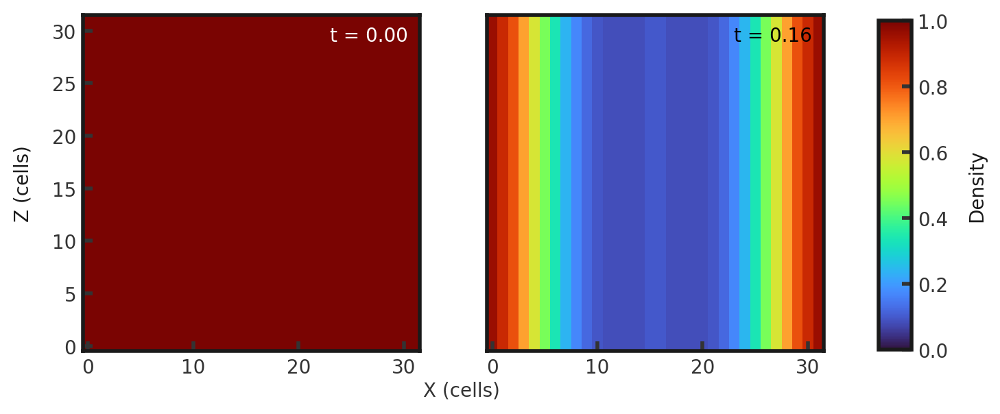

# 3D Einfeldt Strong Rarefaction MHD test
This test highlights the ability of a code to resolve strong and fast rarefaction waves and its accuracy in doing so. Codes may fail, producing nonphysical states of negative density or internal energy due to the majority of the flow energy being kinetic. For more testing information see [MHD Riemann Problems](https://robertcaddy.com/posts/MHD-Riemann-Problems/). The test consists of two nearly identical states separated by a discontinuity at 0.5. Both sides have a denisty of 1.0, pressure of 0.45, and magnetic fields of 0.5 $\hat{y}$. They have equal but opposite velocities of 2 $\hat{x}$. Gamma is set to 1.4. This test is performed with the mhd build (`cholla/builds/make.type.mhd`).

## Parameter file: (`cholla/examples/3D/Einfeldt_Strong_Rarefaction.txt`)
```
#
# Parameter File for 3D Einfeldt Strong Rarefaction MHD test
# Citation: Einfeldt et al. 1991 "On Godunov-Type Methods near Low Densities"
#

################################################
# number of grid cells in the x dimension
nx=32
# number of grid cells in the y dimension
ny=32
# number of grid cells in the z dimension
nz=32
# final output time
tout=0.16
# time interval for output
outstep=0.16
# name of initial conditions
init=Riemann

# domain properties
xmin=0.0
ymin=0.0
zmin=0.0
xlen=1.0
ylen=1.0
zlen=1.0

# type of boundary conditions
xl_bcnd=3
xu_bcnd=3
yl_bcnd=3
yu_bcnd=3
zl_bcnd=3
zu_bcnd=3

# path to output directory
outdir=./

#################################################
# Parameters for 1D Riemann problems
# density of left state
rho_l=1.0
# velocity of left state
vx_l=-2.0
vy_l=0.0
vz_l=0.0
# pressure of left state
P_l=0.45
# Magnetic field of the left state
Bx_l=0.0
By_l=0.5
Bz_l=0.0

# density of right state
rho_r=1.0
# velocity of right state
vx_r=2.0
vy_r=0.0
vz_r=0.0
# pressure of right state
P_r=0.45
# Magnetic field of the right state
Bx_r=0.0
By_r=0.5
Bz_r=0.0

# location of initial discontinuity
diaph=0.5
# value of gamma
gamma=1.4
```
Upon completion, you should obtain two output files. The initial and final densities (in code units) of a slice along the y-midplane is shown below. Examples of how to plot projections and slices can be found in `cholla/python_scripts/Projection_Slice_Tutorial.ipynb`.  
  
A skewer in x along  y and z midplanes yields the 1-dimensional solution:  
  
We see two fast rarefaction waves moving outwards from where they meet at the center of the grid. 
