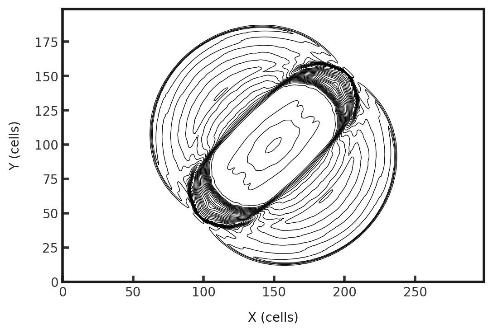
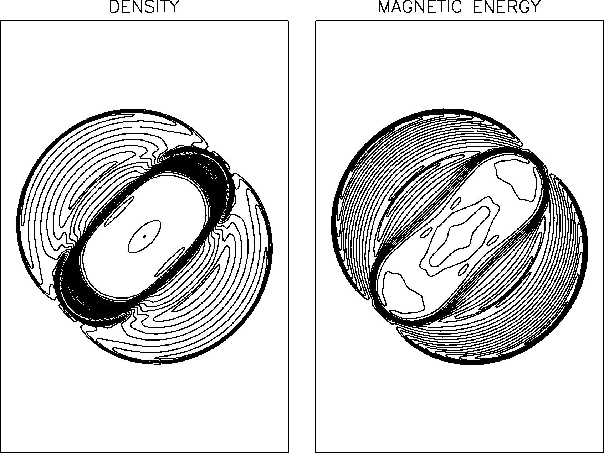

# 3D MHD Blast
Illustrates the ability of the code to handle low strong shocks and rarefactions in 3D. This test involves a centrally overpressurized region exploding into a low pressure and low density medium, causing a circular blast wave to proppagate outwards and a rarefaction which propagates inward. The background density and pressure are 1.0 and 0.1. Inside the blast region of radius 0.1 the pressure is 10.0. The magnetic field is initialized to $\frac{1}{\sqrt{2}}$($\hat{x}$ + $\hat{y}$). Gamma is set to 1.666666666666667. This test is performed with the mhd build (`cholla/builds/make.type.mhd`). Full initial conditions can be found in `cholla/src/grid/initial_conditions.cpp`under `MHD_Spherical_Blast()`. 

## Parameter file: (`cholla/examples/3D/mhd_blast.txt`)
```
#
# Parameter File for the MHD Blast wavelength
# See [Stone & Gardiner 2009](https://ui.adsabs.harvard.edu/abs/2009NewA...14..139S/abstract) for details.
#

################################################
# number of grid cells in the x dimension
nx=200
# number of grid cells in the y dimension
ny=300
# number of grid cells in the z dimension
nz=200
# final output time
tout=0.2
# time interval for output
outstep=0.2
# name of initial conditions
init=MHD_Spherical_Blast
# domain properties
xmin=-0.5
ymin=-0.75
zmin=-0.5
xlen=1.0
ylen=1.5
zlen=1.0
# type of boundary conditions
xl_bcnd=1
xu_bcnd=1
yl_bcnd=1
yu_bcnd=1
zl_bcnd=1
zu_bcnd=1
# path to output directory
outdir=./

#################################################
# Parameters for MHD Blast Wave problem

# initial density
rho=1.0
# velocity in the x direction
vx=0.0
# velocity in the y direction
vy=0.0
# velocity in the z direction
vz=0.0
# initial pressure outside the blast zone
P=0.1
# initial pressure inside the blast zone. Note that the paper says this should be 100, that is a typo
P_blast=10.0
# The radius of the blast zone
radius=0.1
# magnetic field in the x direction. Equal to 1/sqrt(2)
Bx=0.70710678118654746
# magnetic field in the y direction. Equal to 1/sqrt(2)
By=0.70710678118654746
# magnetic field in the z direction
Bz=0.0

# value of gamma
gamma=1.666666666666667
```
Upon completion, you should obtain two output files. The initial and final densities and total pressures (in code units) of a slice along the z-midplane is shown below. Examples of how to plot projections and slices can be found in `cholla/python_scripts/Projection_Slice_Tutorial.ipynb`.  

  
  

By changing the outstep to 0.005, you will obtain 41 output files and can obtain the evolution of the density (here at 10 fps):  

https://github.com/evazlimen/cholla-example-tests/assets/109487593/e3ef12b4-40e8-49f4-acaf-a48d85132a59

We see a rarefaction wave propagating inwards, creating a region of low density inside the blast radius. At the same time, there is a circular blast wave moving outwards. The contours are smooth and symmetrical.

We can compare to the final density contours of Stone and Gardiner (2008):  
Cholla:  
  

Stone and Gardiner:  
  
  
