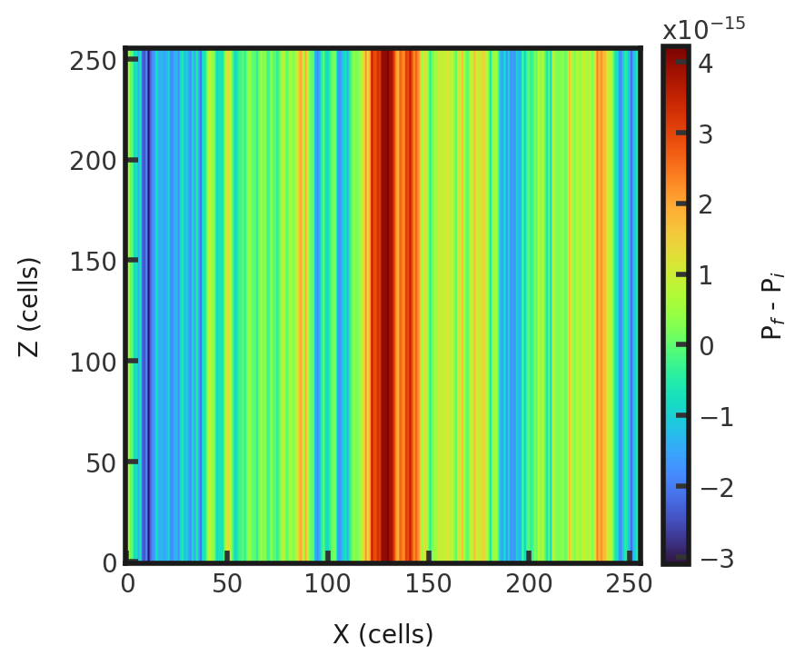

# 3D MHD Contact Wave
This is a linear wave in which denisty changes but pressure is held constant. This test consists of an initial density of 1.0, initial pressure of 0.6, and velocity of 1 $\hat{x}$.The left side has a magnetic field of 0.75 $\hat{x}$ + 1 $\hat{y}$ while the right side has a magnetic field of  $\hat{x}$ +1.5 $\hat{y}$. Gamma is set to 1.666666666666667. A linear wave is initialized with amplitude 1e-6. This test is performed with the mhd build (`cholla/builds/make.type.mhd`). Full initial conditions can be found in `cholla/src/grid/initial_conditions.cpp`under `Linear_Wave()`. 

## Parameter file: (`cholla/examples/3D/mhd_contact_wave.txt`)
```
#
# Parameter File for MHD contact wave
# See [this blog post](https://robertcaddy.com/posts/Classes-and-bugfixing-6/)
# for details on each wave
# The right eigenvector for this wave is:
# (1/2) * [2, +/-2, 0, 0, 0, 0, 0, 1]
# The terms with two sign options: use the left one for right moving waves and
# the right one for left moving waves
#

################################################
# number of grid cells in the x dimension
nx=256
# number of grid cells in the y dimension
ny=256
# number of grid cells in the z dimension
nz=256
# final output time
tout=1.0
# time interval for output
outstep=1.0
# name of initial conditions
init=Linear_Wave
# domain properties
xmin=0.0
ymin=0.0
zmin=0.0
xlen=1.0
ylen=1.0
zlen=1.0
# type of boundary conditions
xl_bcnd=1
xu_bcnd=1
yl_bcnd=1
yu_bcnd=1
zl_bcnd=1
zu_bcnd=1
# path to output directory
outdir=./

#################################################
# Parameters for linear wave problems
# initial density
rho=1.0
# velocity in the x direction
vx=1
# velocity in the y direction
vy=0
# velocity in the z direction
vz=0
# initial pressure
P=0.6
# magnetic field in the x direction
Bx=1
# magnetic field in the y direction
By=1.5
# magnetic field in the z direction
Bz=0
# amplitude of perturbing oscillations
A=1e-6
# value of gamma
gamma=1.666666666666667
# The right eigenvectors to set the wave properly
rEigenVec_rho=1.0
rEigenVec_MomentumX=1.0
rEigenVec_MomentumY=0.0
rEigenVec_MomentumZ=0.0
rEigenVec_Bx=0.0
rEigenVec_By=0.0
rEigenVec_Bz=0.0
rEigenVec_E=0.5
```
Upon completion, you should obtain two output files. The difference in final and initial total pressure (in code units) of a slice along the y-midplane is shown below. Examples of how to plot projections and slices can be found in `cholla/python_scripts/Projection_Slice_Tutorial.ipynb`.  
  
Pressure is held uniform to the $10^{-15}$ decimal level, indicating the code has sufficiently maintained a uniform pressure over the integration.  
By changing the outstep to 0.01, you will obtain 101 output files and can obtain the evolution of the density (here at 10 fps):  


We see the wave moving smoothly and periodically from left to right. 
