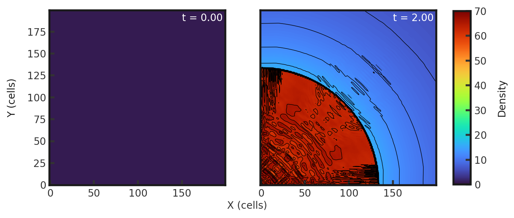
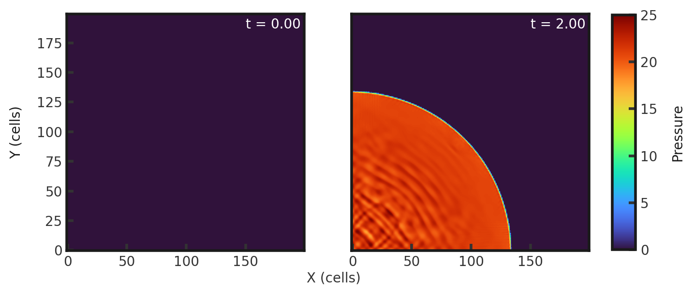
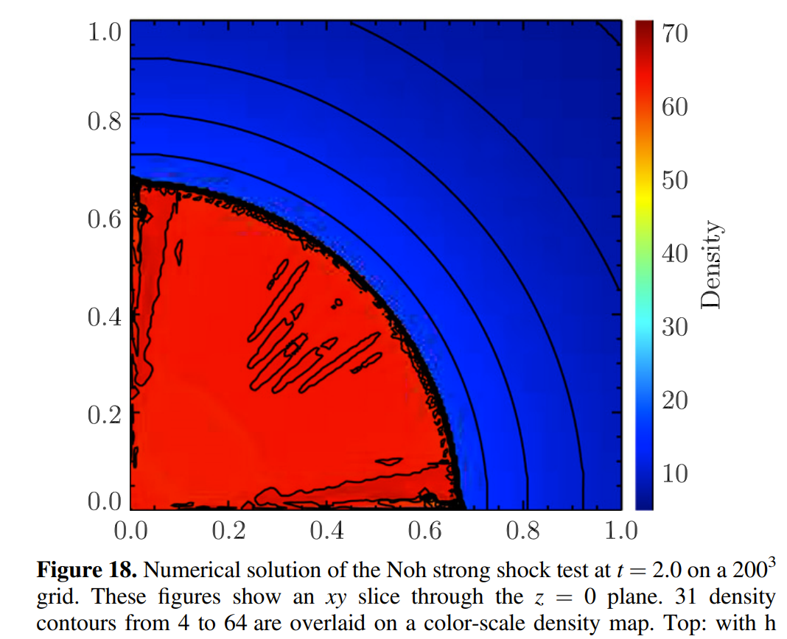

# 3D Noh Strong Shock
This test highlights the ability of a code to track a high Mach number shock. Parameters from Stone 2008. The test consists of an infinitely strong spherical shock radiating from the origin. There is initially a constant density of 1.0 across the grid and a velocity of 1.0 towards the center everywhere. Pressure is set to $10^{-6}$ everywhere Gamma is set to 1.66666667. This test is performed with the default hydro build (`cholla/builds/make.type.hydro`).  

**Important**: refer to [issue 323](https://github.com/cholla-hydro/cholla/issues/323) in order to run on dev.  

## Parameter file: (`cholla/examples/3D/Noh_3D.txt`)
```
#
# Parameter File for the 3D Noh problem described in Stone, 2008.
#

######################################
# number of grid cells in the x dimension
nx=200
# number of grid cells in the y dimension
ny=200
# number of grid cells in the z dimension
nz=200
# output time
tout=2.0
# how often to output
outstep=0.01
# value of gamma
gamma=1.66666667
# name of initial conditions
init=Noh_3D
# domain properties
xmin=0.0
ymin=0.0
zmin=0.0
xlen=1.0
ylen=1.0
zlen=1.0
# type of boundary conditions
xl_bcnd=2
xu_bcnd=4
yl_bcnd=2
yu_bcnd=4
zl_bcnd=2
zu_bcnd=4
custom_bcnd=noh
# path to output directory
outdir=./
```
Upon completion, you should obtain 200 output files. The initial and final densities and pressures (in code units) of a slice of the xy plane along z=0 are shown below. 31 density contours from 4 to 64 are overlaid on the final density plot. Examples of how to plot projections and slices can be found in `cholla/python_scripts/Projection_Slice_Tutorial.ipynb`.  
  

  

We can compare to the original figure from Schneider and Robertson, 2015 (without the h correction):  
  
The same density contours are drawn. However, the present solution appears noisier.
