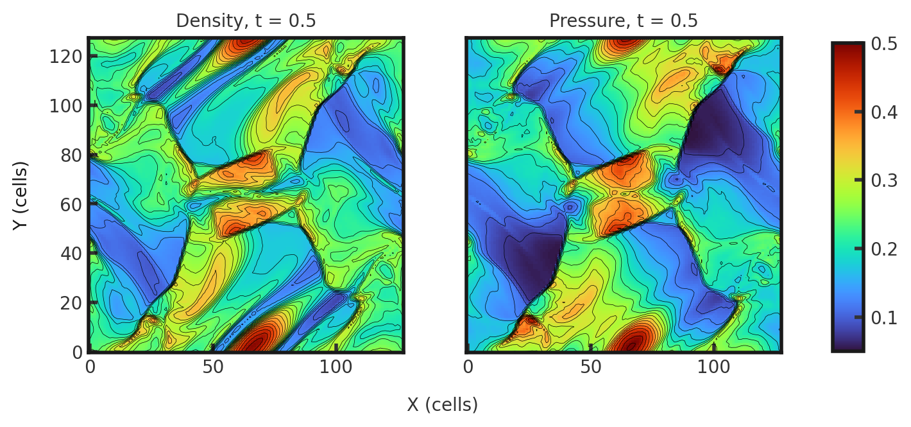
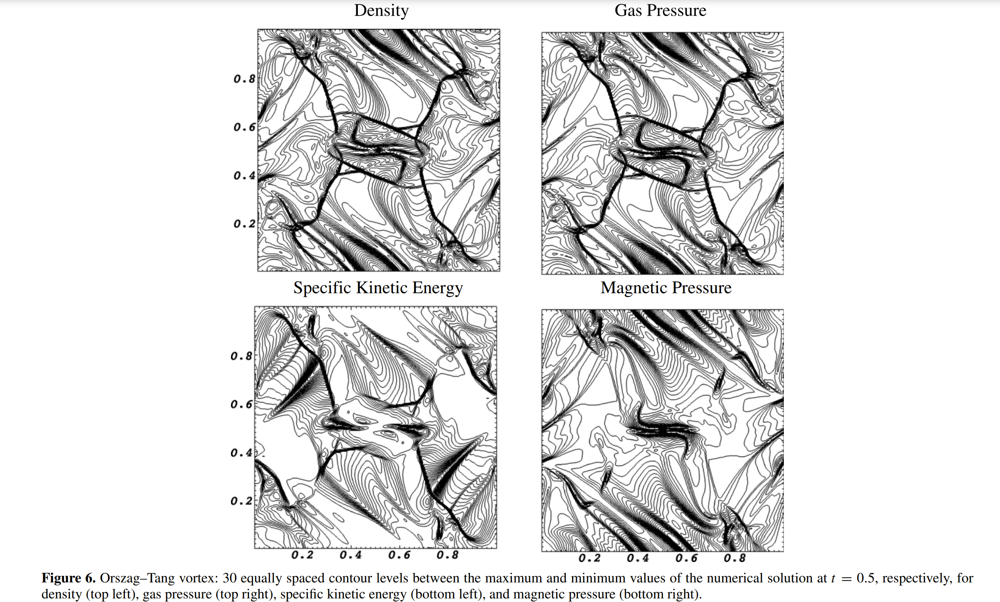

# 3D Orszag-Tang Vortex 
Described in Orszag and Tang, 1979. This test explores the transition to supersonic MHD turbulence. It illustrates the ability of a code to handle shock-shock interactions as well as the formation of MHD shocks and turbulent dynamics. This test is performed with the mhd build (`cholla/builds/make.type.mhd`).Full initial conditions can be found in `cholla/src/grid/initial_conditions.cpp`under `Orszag_Tang_Vortex()`. 

## Parameter file: (`cholla/examples/3D/orszag_tang_vortex.txt`)
```
#
# Parameter File for the Orszag-Tang Vortex
# See [Gardiner & Stone 2008](https://arxiv.org/abs/0712.2634)
#

################################################
# number of grid cells in the x dimension
nx=128
# number of grid cells in the y dimension
ny=128
# number of grid cells in the z dimension
nz=128
# final output time
tout=0.5
# time interval for output
outstep=0.5
# name of initial conditions
init=Orszag_Tang_Vortex
# domain properties
xmin=0.0
ymin=0.0
zmin=0.0
xlen=1.0
ylen=1.0
zlen=1.0
# type of boundary conditions
xl_bcnd=1
xu_bcnd=1
yl_bcnd=1
yu_bcnd=1
zl_bcnd=1
zu_bcnd=1
# path to output directory
outdir=./

#################################################
# Parameters for Orszag-Tang Vortex. This problem is defined for a specific set
# of initial conditions which have been hard coded into the initial conditions
# function. The only thing that needs set here is the adiabatic index

# value of gamma
gamma=1.666666666666667
```
Upon completion, you should obtain two output files. The final density and total pressures (in code units) of a slice along the z-midplane is shown below as a color coded contour plot. Examples of how to plot projections and slices can be found in `cholla/python_scripts/Projection_Slice_Tutorial.ipynb`.  
  

For both density and pressure, we see a vortex growing from the center of the grid. The contours are not perfectly symmetrical, highlighting the small scale disontinuities and vortices.  

We can compare to the solution of Martin and Miniati 2011:  
  

With outstep = 0.01, you will obtain 51 output files and can obtain the evolution of the total density (here at 10 fps):  

https://github.com/evazlimen/cholla-example-tests/assets/109487593/5bc07396-8630-4e93-a5e4-7c45be453d36

