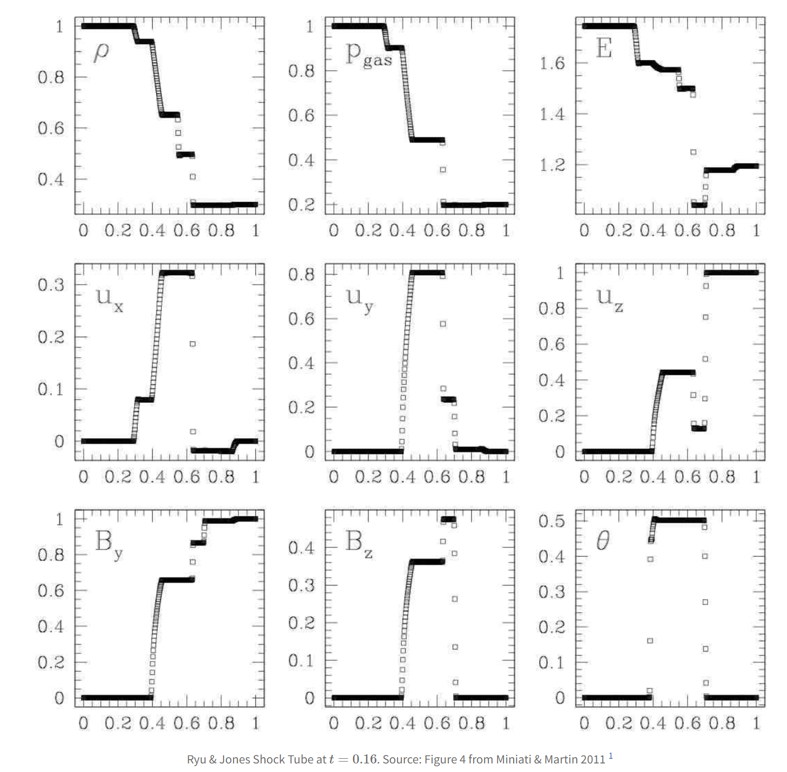

# 3D Ryu and Jones MHD shock tube 4d
This MHD shock tube has a switch-on slow rarefaction, causing the tangential magnetic field to turn on.  Parameters from  Ryu & Jones 1995. For more testing information see [MHD Riemann Problems](https://robertcaddy.com/posts/MHD-Riemann-Problems/). The test consists of a left state with density and pressure of 1.0 and magnetic field of 0.7 $\hat{x}$. The right state consists of a density of 0.3, pressure of 0.2, velocity of 1.0 $\hat{z}$, and magnetic field of 0.7 $\hat{x}$ + 1.0 $\hat{y}$. Gamma is set to 1.6666666666666667 and the initial discontinuity is at 0.5. This test is performed with the mhd build (`cholla/builds/make.type.mhd`). 

## Parameter file: (`cholla/examples/3D/Ryu_and_Jones_4d.txt`)
```
#
# Parameter File for 3D Ryu & Jones MHD shock tube 4d.
# Citation: Ryu & Jones 1995 "Numerical Magnetohydrodynamics in Astrophysics:
# Algorithms and Tests for One-Dimensional Flow"
#
# Note: There are many shock tubes in this paper. This settings file is
# specifically for shock tube 4d
#

################################################
# number of grid cells in the x dimension
nx=64
# number of grid cells in the y dimension
ny=64
# number of grid cells in the z dimension
nz=64
# final output time
tout=0.16
# time interval for output
outstep=0.16
# name of initial conditions
init=Riemann

# domain properties
xmin=0.0
ymin=0.0
zmin=0.0
xlen=1.0
ylen=1.0
zlen=1.0

# type of boundary conditions
xl_bcnd=3
xu_bcnd=3
yl_bcnd=3
yu_bcnd=3
zl_bcnd=3
zu_bcnd=3

# path to output directory
outdir=./

#################################################
# Parameters for 1D Riemann problems
# density of left state
rho_l=1.0
# velocity of left state
vx_l=0.0
vy_l=0.0
vz_l=0.0
# pressure of left state
P_l=1.0
# Magnetic field of the left state
Bx_l=0.7
By_l=0.0
Bz_l=0.0

# density of right state
rho_r=0.3
# velocity of right state
vx_r=0.0
vy_r=0.0
vz_r=1.0
# pressure of right state
P_r=0.2
# Magnetic field of the right state
Bx_r=0.7
By_r=1.0
Bz_r=0.0

# location of initial discontinuity
diaph=0.5
# value of gamma
gamma=1.6666666666666667
```
Upon completion, you should obtain two output files. The initial and final densities (in code units) of a slice along the y-midplane is shown below. Examples of how to plot projections and slices can be found in `cholla/python_scripts/Projection_Slice_Tutorial.ipynb`.  
  
  
  
A skewer in x along y and z midplanes yields the 1-dimensional solution (note that it is showing total gas pressure). $\theta$ is defined at $\tan^{-1}\left(\frac{B_{z}}{B_{y}}\right)$:  
  
  
From left to right, we see a rarefaction wave followed by the switch on slow shock, contact discontinuity, slow shock, alfven/rotation wave, and fast rarefaction.  

We can compare this to the solution of Ryu and Jones, 1995:
  

The solution for $\theta$ appears to be different than calculated.

