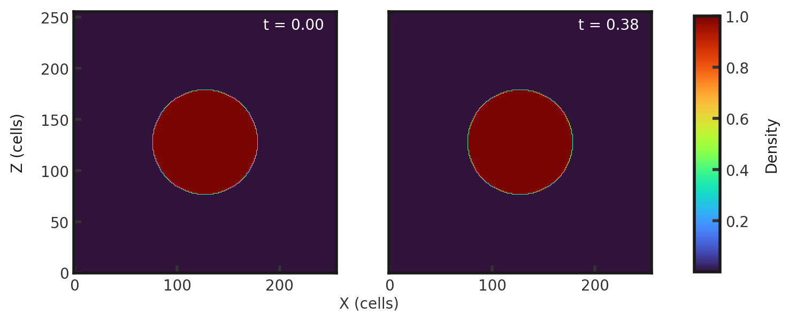
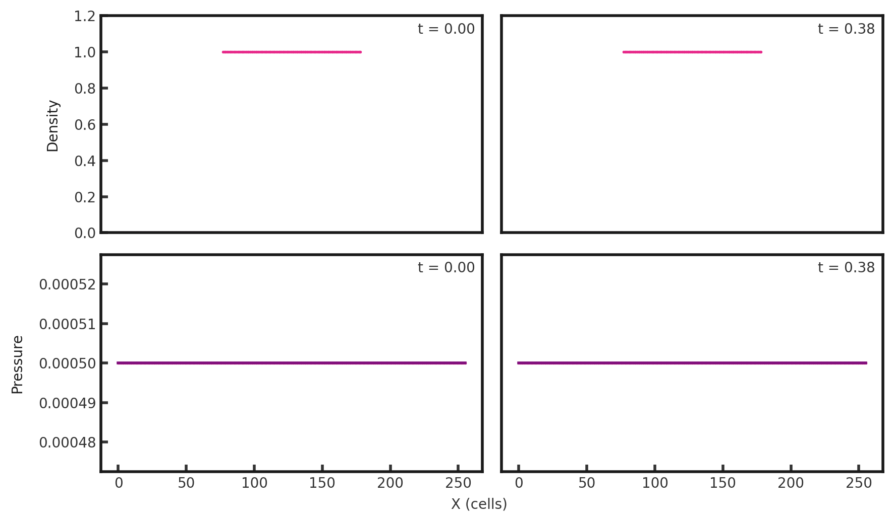

# 3D Spherical Collapse
This test illustrates the ability of a code to handle gravitational collapse due to spherical overdensity. The test consists of a sphere of radius 0.2 centered at (0.5, 0.5, 0.5) with a density of 1, surrounded by a background density of 0.0005. Pressure is constant everywhere at 0.0005. This test is performed with the ??? build (`cholla/builds/make.type.??`). Full initial conditions can be found in `cholla/src/grid/initial_conditions.cpp`under `Spherical_Overdensity_3D()`. 

## Parameter file: (`cholla/examples/3D/Spherical_Collapse.txt`)
Note that the output directory needs to be changed for the user.
```
#
# Parameter File for the 3D Sphere Collapse.
#

######################################
# number of grid cells in the x dimension
nx=256
# number of grid cells in the y dimension
ny=256
# number of grid cells in the z dimension
nz=256
# output time
tout=0.38
# how often to output
outstep=0.01
# value of gamma
gamma=1.66666667
# name of initial conditions
init=Spherical_Overdensity_3D
# domain properties
xmin=0.0
ymin=0.0
zmin=0.0
xlen=1.0
ylen=1.0
zlen=1.0
# type of boundary conditions
xl_bcnd=1
xu_bcnd=1
yl_bcnd=1
yu_bcnd=1
zl_bcnd=1
zu_bcnd=1
# path to output directory
outdir=/data/groups/comp-astro/bruno/cosmo_sims/sphere_collapse/output_files/
#outdir=/raid/bruno/data/cosmo_sims/cholla_pm/sphere_collapse/
#outdir=/gpfs/alpine/scratch/bvilasen/ast149/sphere_collapse/output_files/
```
Upon completion, you should obtain 39 output files. The initial and final densities (in code units) of a slice along the y-midplane is shown below.  Examples of how to plot projections and slices can be found in `cholla/python_scripts/Projection_Slice_Tutorial.ipynb`.  
  
A skewer in x along y and z midplanes yields the 1-dimensional solution (density and pressure):  
  
Currently (8/1/23) this test is producing identical initial and final states regardless of whether the default hydro or gravity build is used. 
